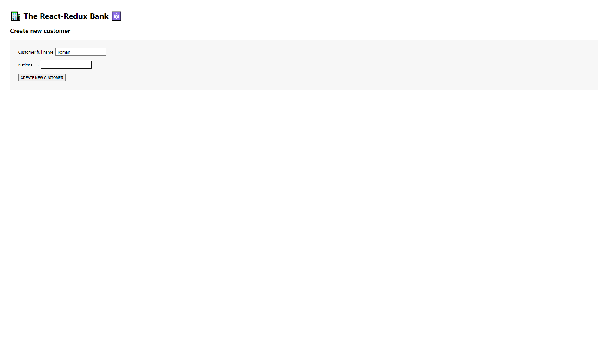
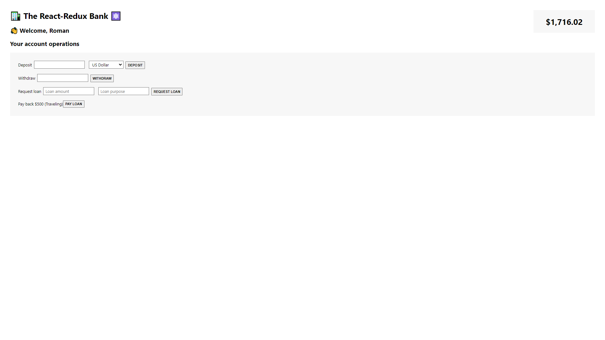

# The React-Redux Bank App

A simple fake-application for banking built with React and Redux. It allows to create users, conduct banking operations, currency conversion (by using Frankfurter API) and display current balance.

## Features:

-   Create new customers
-   Perform banking operations (deposits, withdrawals, loan requests)
-   Display current balance
-   Manage customer information

### Tools used:

-   React 18
-   Redux
-   Redux Thunk
-   Redux Toolkit
-   Redux Devtools
-   Frankfurter API
